# Diagramas e Fluxos

> Use [Mermaid](https://mermaid.js.org/) para descrever fluxos.

## 1. Fluxo de Init (Bootstrap)

```mermaid
sequenceDiagram
    participant User
    participant CLI
    participant Blueprint
    participant Git

    User->>CLI: yby init
    CLI->>CLI: Check Pre-reqs (git, docker)
    CLI->>User: Pergunta Dúvidas (Interactive)
    User->>CLI: Respostas
    CLI->>Blueprint: Renderiza Template
    Blueprint->>FileSys: Cria Arquivos
    CLI->>Git: Initial Commit
    CLI->>User: Sucesso
```



## 2. Fluxo de Release

```mermaid
flowchart TD
    A[Dev] -->|Commit (feat/fix)| B(Branch develop)
    B -->|PR| C(Branch main)
    C -->|Merge| D{GitHub Action}
    D -->|GoReleaser| E[Release vX.Y.Z]
    E -->|Artifacts| F[Binaries / Docker]
```
