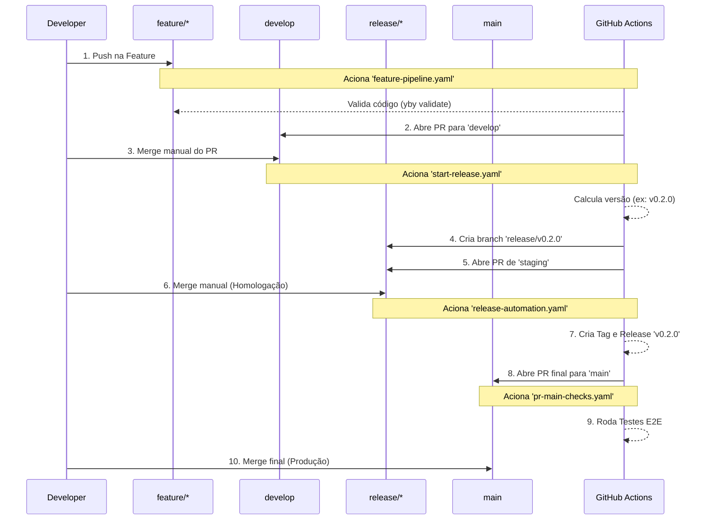

# 🚀 Yby CLI - GitOps Radical

<div align="center">


</div>

> **Yby (Tupi: Terra)** - O solo fértil para suas aplicações. CLI oficial para provisionamento de clusters Kubernetes **Ecofuturistas**: GitOps Radical, Eficiência Energética e Zero-Touch Discovery.

---

## 📋 Visão Geral

A **Yby CLI** não é apenas um gerador de scaffolds; é a interface unificada para gerenciar todo o ciclo de vida da infraestrutura da Casheiro Org.

- **Agnóstico**: Suporte a topologias flexíveis (`local`, `standard`, `complete`) via `blueprint.yaml`.
- **Offline & Self-Contained**: Dev local (`yby dev`) funciona totalmente offline com Mirror Git interno.
- **Monorepo Ready**: Suporte nativo para infraestrutura em subdiretórios (`infra/`) com CI/CD na raiz.
- **Ecofuturista**: Padrões nativos para eficiência energética (Kepler) e scale-to-zero (KEDA).
- **GitOps Puro**: Tudo é gerenciado via Argo CD. Sem comandos imperativos no cluster.

---

## 💻 Pré-requisitos

Para rodar o stack completo (Argo CD, Monitoramento, K3s) localmente ou em VPS:

| Componente | Requisito Mínimo | Recomendado |
|------------|------------------|-------------|
| **RAM**    | 4 GB             | 8 GB+       |
| **CPU**    | 2 vCPUs          | 4 vCPUs     |
| **Disk**   | 20 GB            | 40 GB NVMe  |

> **Nota**: Para usuários Linux/Mac, certifique-se de que o **Docker** está rodando e seu usuário possui permissões (grupo `docker` ou `sudo`).

## 🚀 Instalação

```bash
# Via Go
go install github.com/casheiro/yby-cli@latest

# Ou via binários pré-compilados (Linux/Mac/Windows) na página de Releases
```

Para verificar a instalação e dependências locais (Docker, Helm, Kubectl):

```bash
yby doctor
```

---

## 🛠️ Começando (Getting Started)

A v2 do Yby CLI utiliza uma **Engine de Scaffold Nativa** e gestão de ambientes explícita.

### 1. Inicializar Projeto (`yby init`)

Gera a estrutura completa de um repositório GitOps pronto para produção.

```bash
# Modo Interativo (Wizard)
yby init

# Modo Headless (Automação)
yby init --topology standard --workflow gitflow --git-repo https://github.com/my-org/proj.git
```

### 2. Bootstrap do Cluster (`yby bootstrap`)

Transforme um cluster Kubernetes vazio (local ou remoto) em uma plataforma completa.

```bash
# Boostrap do cluster conectado no contexto atual do kubectl
yby bootstrap cluster
```
> O comando detectará automaticamente se é um cluster local ou remoto e aplicará as configurações apropriadas.

---

## 🔄 Fluxo de Release Automatizado

Ao escolher o workflow `gitflow` no `init`, o projeto é configurado com Github Actions que implementam um pipeline de release robusto:



---

## 🌍 Gerenciamento de Contexto

O Yby gerencia múltiplos ambientes (ex: local, staging, prod) com total isolamento de variáveis.

```bash
# Listar ambientes disponíveis
yby env list

# Trocar contexto ativo (Carrega variáveis de .yby/environments.yaml)
yby context use prod

# Ver detalhes do ambiente atual
yby context show
```

---

## 🤖 Governança e IA (DevGovOps)

Este projeto adota o padrão **DevGovOps**, integrando governança diretamente no fluxo de desenvolvimento assistido por IA.

- **`.synapstor/`**: Fonte canônica da verdade e conhecimento (UKIs).
- **`.agent/`**: Regras e workflows para a IDE Antigravithy.
- **`.trae/` / `.claude/`**: Configurações para outros agentes.

Consulte a [Wiki](docs/wiki/Governance.md) para detalhes sobre como capturar e evoluir o conhecimento do projeto.

---

## 📂 Estrutura Criada

```
.
├── .github/workflows/    # Pipelines CI/CD (GitOps)
├── .yby/
│   ├── blueprint.yaml    # Definição do projeto
│   └── environments.yaml # Configuração de ambientes
├── config/               # Values globais do ArgoCD
├── infra/                # Manifestos Kubernetes
│   ├── charts/           # Helm Charts locais (System, Bootstrap)
│   └── manifests/        # Manifestos puros (Argo Apps)
└── README.md
```

## 📚 Documentação Adicional

A documentação completa está mantida na pasta `docs/wiki`:

- [Arquitetura](docs/wiki/Architecture.md)
- [Guia de Segurança](docs/wiki/Security-Architecture.md)
- [Solução de Problemas](docs/wiki/Troubleshooting.md)
