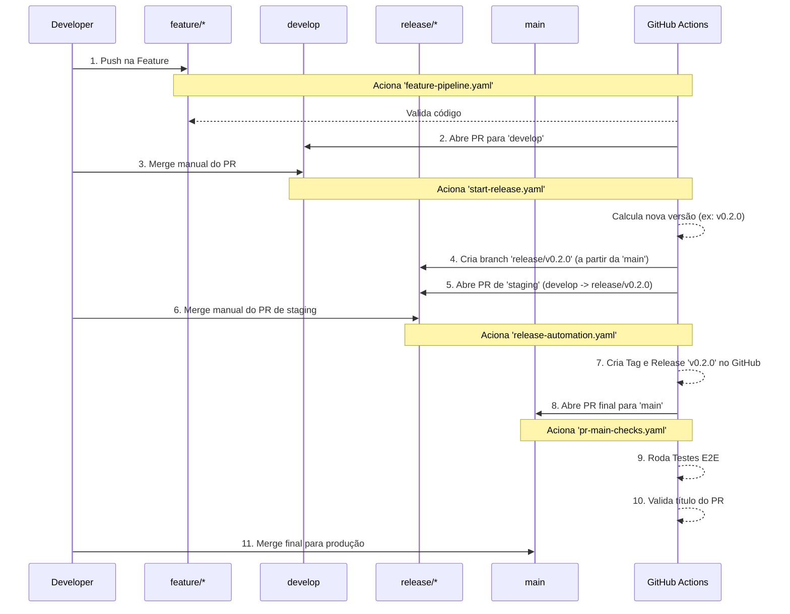

# 🚀 Yby - GitOps Radical

<div align="center">


</div>

> **Yby (Tupi: Terra)** - O solo fértil para suas aplicações. Cluster Kubernetes **Ecofuturista**: GitOps Radical, Eficiência Energética e Zero-Touch Discovery.

---

## ⚠️ Avisos Importantes

> **🔒 TLS está desativado por padrão**  
> Para habilitar HTTPS automático, ajuste `ingress.tls.enabled: true` em `config/cluster-values.yaml` e instale o Cert-Manager.  
> 📖 Consulte o [Guia de Produção](docs/PRODUCAO-GUIDE.md) para instruções completas.

> **✅ Discovery está habilitado (`discovery.enabled: true`)**  
> Aplicações são descobertas automaticamente via GitHub Topics.  
> Para desativar, ajuste a flag em `config/cluster-values.yaml`.

---

## 📋 Visão Geral

Este repositório contém toda a infraestrutura como código (IaC) para provisionar e gerenciar clusters Kubernetes com **GitOps**.

- **Agnóstico**: Use este template para múltiplos clusters/clientes apenas alterando a configuração.
- **Ecofuturista**: Eficiência radical (K3s), transparência energética (Kepler) e scale-to-zero (KEDA).
- **Zero-Touch**: Adicione aplicações apenas criando repositórios no GitHub com a tag correta.
- **GitOps Puro**: Tudo é gerenciado via Argo CD. Sem comandos imperativos no cluster.
- **Full CLI**: Gerenciamento 100% via `yby` CLI em Go. Adeus Makefiles e scripts.


### Fluxo de Release 100% Automático

Este repositório implementa um fluxo de release totalmente automatizado, desde a integração da feature até a criação do PR para produção. O processo é orquestrado por múltiplos workflows do GitHub Actions.



#### Etapas do Fluxo:

1.  **Desenvolvimento (`feature/*`)**
    -   Ao fazer `push` para uma branch `feature/*`, o workflow `feature-pipeline.yaml` é acionado.
    -   Ele roda validações estáticas (`yby validate`).
    -   Se a validação passar, ele abre automaticamente um Pull Request da sua branch para a `develop`.

2.  **Integração (`develop`)**
    -   O PR para a `develop` é revisado e mergeado manualmente.
    -   O merge na `develop` dispara o workflow `start-release.yaml`. Este é o início do processo de release.

3.  **Staging da Release (`release/*`)**
    -   O `start-release.yaml` calcula a próxima versão com base nos commits.
    -   Ele cria a nova branch de release (ex: `release/v0.2.0`) a partir da `main`, garantindo uma base estável.
    -   Em seguida, ele abre um PR para mergear a `develop` (com as novas features) dentro da nova branch `release/v0.2.0`.
    -   Um comentário é postado no commit de merge da `develop` com o link para este novo PR de "staging".

4.  **Finalização da Release**
    -   O PR de staging é revisado e mergeado manualmente na branch `release/v0.2.0`.
    -   Este merge dispara o `release-automation.yaml`.
    -   **Ações:** Ele cria a Tag Git (`v0.2.0`), cria a Release oficial na interface do GitHub (com changelog automático) e abre o Pull Request final da `release/v0.2.0` para a `main`.

5.  **Produção (`main`)**
    -   O PR para a `main` é o portão final para produção. Sua criação dispara o `pr-main-checks.yaml`.
    -   **Verificações Obrigatórias:** Este workflow roda a validação de título de commit e a suíte completa de testes End-to-End (E2E).
    -   Somente com o sucesso de todos os testes, o PR pode ser mergeado na `main`.


---

## 🎯 Como Usar (Template de Plataforma)

Este repositório foi desenhado para funcionar como um **Template de Engenharia de Plataforma**.

### 1. Adote o Template
Faça um **Fork** ou clique em **"Use this template"** para criar sua própria versão base da plataforma.

### 2. Prepare o Ambiente (`yby setup`)
O Yby possui uma CLI integrada que facilita a instalação das dependências (k3d, helm, kubectl).

```bash
# 1. Instale a CLI (Binário)
# Linux / WSL
curl -L https://github.com/casheiro/yby-cli/releases/latest/download/yby_linux_amd64 -o yby
chmod +x yby
sudo mv yby /usr/local/bin/

# 2. Rode o Setup Interativo
yby setup
```

### 3. Bootstrap do Cluster (`yby bootstrap`)

Para criar um cluster local e instalar toda a stack GitOps:

```bash
# 1. Subir Cluster Local
yby dev
# (Internamente chama 'yby setup' e 'yby bootstrap cluster')

# 2. Verifique o Status
yby doctor
```

---

---

## 🛠️ Uso Agente & Smart Init

O Yby agora opera com um **Blueprint Engine**. Quando você roda `yby init`, a CLI lê o arquivo `.yby/blueprint.yaml` deste repositório para entender quais perguntas fazer e como configurar o cluster.

1.  **Edite o Blueprint (`.yby/blueprint.yaml`)**: Defina versões do ArgoCD e perguntas de setup.
2.  **Rode o Init**: A CLI se adapta automaticamente ao blueprint.

## 🛠️ Uso com Yby CLI (Recomendado)

A **Yby CLI** é a interface padrão do projeto.

> 🔓 **Zero Lock-in:** Prefere usar ferramentas nativas (`kubectl`, `helm`)? 
> Consulte o [Guia de Operação Manual (Zero Lock-in)](docs/MANUAL-REFERENCE.md).

## 💻 Desenvolvimento Local

Suba um ambiente completo (Cluster + Argo CD + Apps) na sua máquina em minutos:

```bash
# Setup inicial (Ferramentas)
yby setup

# Iniciar ambiente (Cria cluster se não existir + Bootstrap)
yby dev

# Dica: Instale 'direnv' e rode 'direnv allow' para carregar o KUBECONFIG automaticamente!
```

Acesse:
- **Argo CD**: https://localhost:8080 (admin / `kubectl -n argocd get secret argocd-initial-admin-secret ...`)
- **Visualização Rápida**: `yby status`
- **Acesso Fácil**: `yby access`

Para destruir o ambiente:
```bash
k3d cluster delete yby-local
# ou
yby clean (não implementado ainda, use k3d direto)
```
Se preferir usar ferramentas nativas (`kubectl`), aqui estão os comandos equivalentes:

### 1. Acesso aos Dashboards
**Argo CD:**
```bash
# Senha de admin
kubectl -n argocd get secret argocd-initial-admin-secret -o jsonpath="{.data.password}" | base64 -d
# Port-forward (Acesse em http://localhost:8085)
kubectl -n argocd port-forward svc/argocd-server 8085:80
```

### 2. Provisionamento e Bootstrap (Zero Touch)

Para transformar um VPS zerado em um cluster de produção:

1.  **Configure o ambiente**:
    Crie um arquivo `.env` na raiz:
    ```bash
    VPS_HOST=seu.ip.aqui
    VPS_USER=root
    GITHUB_REPO=https://github.com/seu-usuario/yby
    GITHUB_TOKEN=seu_token_aqui
    ```

2.  **Instalação Completa**:
    ```bash
    # Instale a CLI se não tiver
    # Instale a CLI (veja acima)
    
    # Provisione
    yby install
    # Ou passo-a-passo:
    # yby bootstrap vps
    # yby bootstrap cluster
    ```

> 📖 Veja o guia detalhado em **[docs/GUIA-VPS-ZERO-TOUCH.md](docs/GUIA-VPS-ZERO-TOUCH.md)**.

---

## 📂 Estrutura do Repositório

├── charts/
│   ├── bootstrap/       # Chart inicial (App of Apps, Argo configs)
│   └── cluster-config/  # Configurações do cluster e CRDs (System)
├── config/
│   └── cluster-values.yaml  # ⚡ ÚNICO ARQUIVO DE CONFIGURAÇÃO (Com Schema JSON)
├── .yby/
│   └── blueprint.yaml   # 🏗️ Definição do Smart Init e Versões de Infra
├── docs/                # Documentação detalhada
├── manifests/           # Manifestos upstream (vendored)
└── workflows/           # Templates de CI/CD (Argo Workflows)
```

## 🌍 Gerenciamento de Contexto (Multi-Ambiente)

O Yby suporta nativamente múltiplos contextos (ex: local, staging, prod) com **Isolamento Estrito**.

```bash
# Listar contextos disponíveis (detectados via .env.* e local/)
yby context list

# Mudar contexto (ex: staging)
yby context use staging
# ✅ Variáveis carregadas APENAS de .env.staging (Segurança total)

# Verificar contexto atual
yby context show
```

---

## 🤖 Governança e Automação com IA

Este projeto utiliza um conjunto de diretórios para integrar e governar o trabalho de assistentes de IA (agentes) diretamente no ciclo de desenvolvimento. Essa abordagem, conhecida como **DevGovOps (Development, Governance, and Operations)**, permite que a IA compreenda o contexto, as regras e os objetivos do projeto, automatizando tarefas com segurança e consistência.

Abaixo está a descrição de cada diretório de governança:

### 🧠 `.synapstor` - O Cérebro do Projeto

O `.synapstor` é o repositório central de conhecimento do projeto. Ele serve como uma "fonte da verdade" para qualquer agente de IA, garantindo que as decisões e automações estejam alinhadas com a arquitetura e os padrões definidos.

-   **Fonte Canônica de Contexto:** Contém o overview do projeto, backlog técnico, diagramas e, mais importante, as **UKIs (Unidades de Conhecimento Inteligente)**.
-   **UKIs (`.synapstor/.uki/`):** São documentos que registram decisões arquiteturais, padrões de código, e regras de negócio de forma estruturada para que a IA possa consultá-las.
-   **Portabilidade:** É agnóstico de IDE e pode ser usado por qualquer ferramenta de IA com capacidade de ler arquivos para se contextualizar sobre o projeto.

### 🧑‍✈️ Diretórios de Agentes por IDE

Embora o `.synapstor` seja a fonte de conhecimento, diferentes IDEs e assistentes podem ter suas próprias configurações de comportamento.

-   **`.agent/` (Antigravithy IDE):** Contém as regras (`rules/`) e workflows (`workflows/`) específicos para o agente que opera na IDE Antigravithy.
-   **`.claude/` (Claude Code IDE):** Armazena configurações locais (`settings.local.json`) para o assistente Claude Code.
-   **`.trae/` (Trae IDE):** Guarda documentos, histórico de interações e regras que governam o agente da IDE Trae.

Essa estrutura garante que, independentemente da ferramenta utilizada pelo desenvolvedor, a IA sempre terá acesso a uma base de conhecimento centralizada e consistente (`.synapstor`), enquanto as configurações específicas de cada agente permanecem organizadas em seus respectivos diretórios.

---

## 📚 Documentação

- **[🚀 Guia de Produção](docs/PRODUCAO-GUIDE.md)** - Deploy completo em produção (TLS, backup, observabilidade, segurança)
- [🔗 Guia de Webhooks](docs/WEBHOOK-GUIDE.md) - Configuração de CI/CD instantâneo (GitHub/GitLab)
- [Setup GitOps Detalhado](docs/GITOPS-SETUP.md) - Configuração passo-a-passo do GitOps
- [Gerenciamento em Produção](docs/GERENCIAMENTO-PRODUCAO.md) - Operação e troubleshooting
- [Apps Externas & Zero-Touch](docs/EXTERNAL-APPS-GITOPS.md) - Discovery automático de aplicações
- [Guia de Desenvolvimento](docs/GUIA-DESENVOLVIMENTO.md) - Ambiente local e validação
- [Configuração Helm](docs/configuracao-helm.md) - Referência completa de `cluster-values.yaml`
- [⚡ Guia KEDA (Eficiência)](docs/GUIA-KEDA.md) - Como configurar Scale-to-Zero
- [Publicação de Apps](docs/PUBLICACAO-APPS-POR-TIPO.md) - Exemplos por linguagem/framework
- [Como Contribuir](CONTRIBUTING.md) - Guia para desenvolvedores do projeto
- [📊 Análise de Mercado](docs/MARKET_ANALYSIS.md) - Comparativo Yby vs Kubefirst/Otomi/Devtron
